# It's On Fire

## Overview

Running the ItsOnFire.apk on an Android device reveals that this is a game where you must destroy all the bone invaders in time.

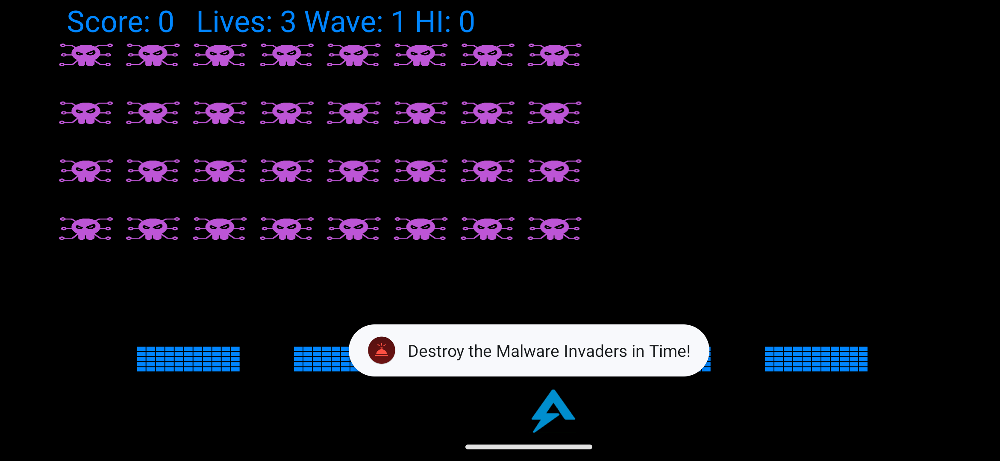

## Analysis

When the APK is loaded in JADX, you will notice that the app is obfuscated with ProGuard.

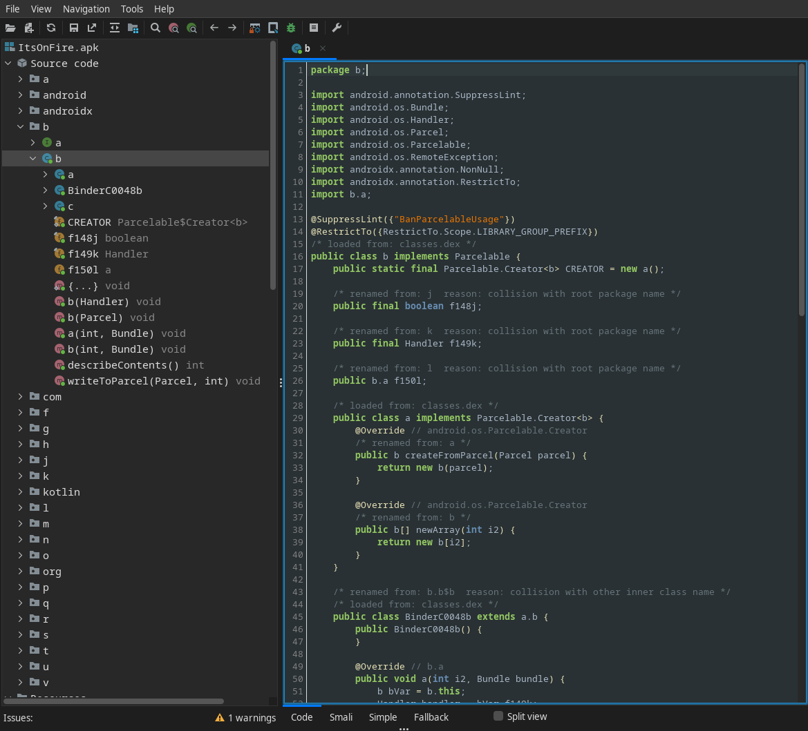

### AndroidManifest.xml

This file contains important information similar to PE's header but for Android:

* Permissions
* Activities and Services
* Intent filters
* ...

If you have implemented a signal handler in C/C++ or Python you will realize that intents is similar to signals and an intent filter is where you capture and handle a specific signal.

It's easy to determine that the main activity is `MalwareInvadersActivity` because of the action `android.intent.action.MAIN`,

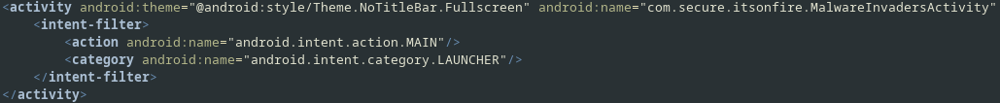 

and the game uses Firebase Cloud Messaging (FCM).

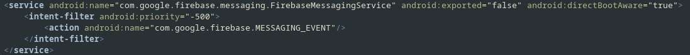

`MessageWorker` is an additional service designed to activate when a new message from FCM (`com.google.firebase.MESSAGING_EVENT`) is received.

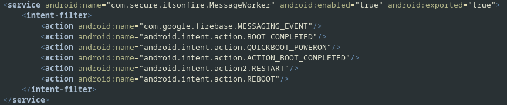

### com.secure.itsonfire.MalwareInvadersActivity

This is the main activity where the game is loaded, along with others class (`Bullet`, `DefenseBrick`, `Invader`, `PlayerShip`) that handle game functions. There is no hidden flag or tricks involved.

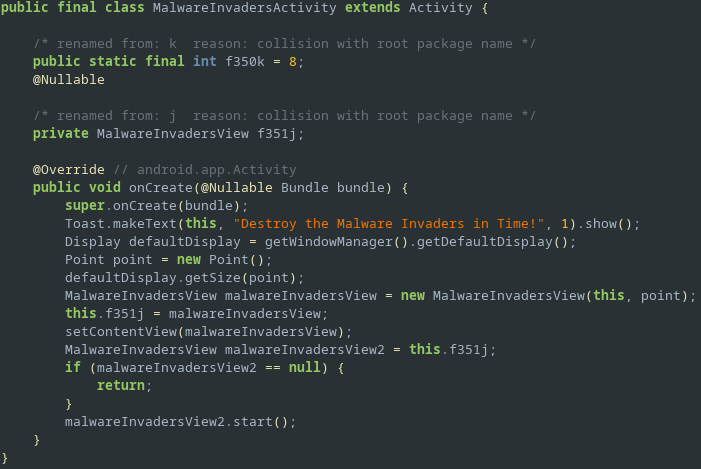

### com.secure.itsonfire.MessageWorker

It extends the `FirebaseMessagingService` class that handle FCM actions.

#### onNewToken

This method send the FCM token to Flare-on server when it is created.

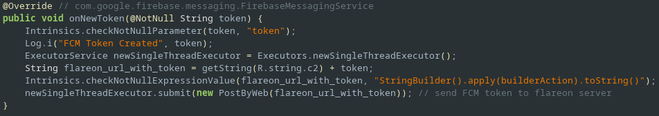

#### onMessageReceived

When a new message is received, a new notification is generated by popping up the return value of `c.f362.a` with the value of `my_custom_key` key as input data.

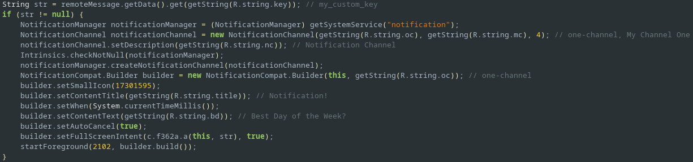

### f.c.f3621.a

This method compares the input value with the days of the week in lowercase. Upon receiving an appropriate input value, certain action such as opening Twitter link, Youtube link, Google Map's location will pop up.

Two images used in this method is encrypted. The method `bVar.f` from `f.b.f` appears suspicious when it receives aforementioned images as input data.

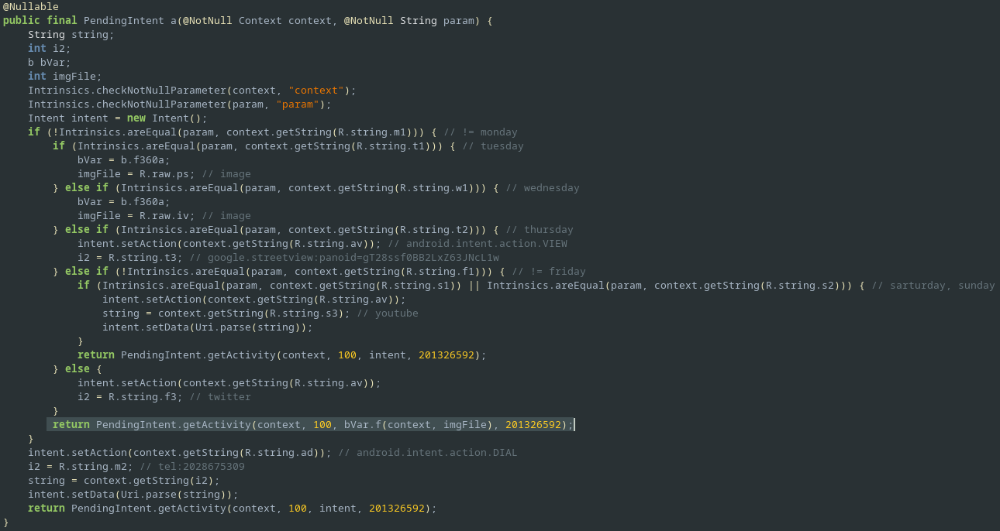

### f.b.f

This method decrypt the image file and return the result as an Intent.

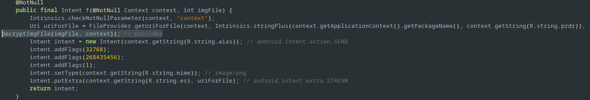

#### decryptImgFile and aesDecrypt

The `decryptImgFile` method performs AES decryption using the key obtained from the `getKey` method and `IV` = `abcdefghijklmnop`.

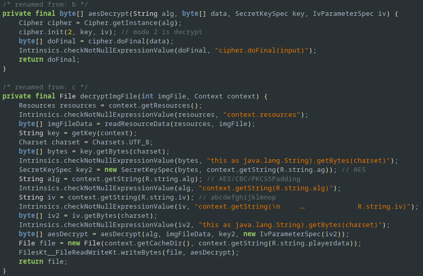

#### getKey

This method returns 16-bytes AES key calculated from the CRC-32 value of the combination of the Flare-On server URL and the string `wednesday`, with some manipulation.

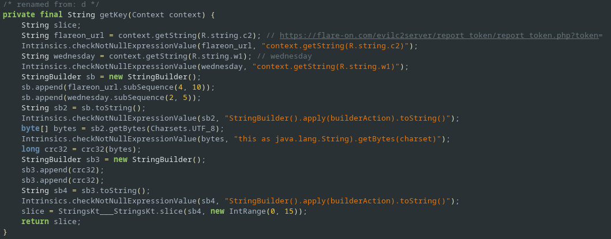

## Solution

The following Python snippet decrypts the `iv.png` file using IV and the key obtained from the `getKey` method.

```python
import binascii

from Crypto.Cipher import AES

def get_key():
    flareon_url = b"https://flare-on.com/evilc2server/report_token/report_token.php?token="
    sb3 = str(binascii.crc32(flareon_url[4:10] + b"wednesday"[2:5]))
    return (sb3 * 2)[:16].encode()


with open("./iv.png", "rb") as f:
    data = f.read()

iv = b"abcdefghijklmnop"
cipher = AES.new(get_key(), AES.MODE_CBC, iv)

with open("flag.png", "wb") as f:
    f.write(cipher.decrypt(data))
```

Decrypted image:


