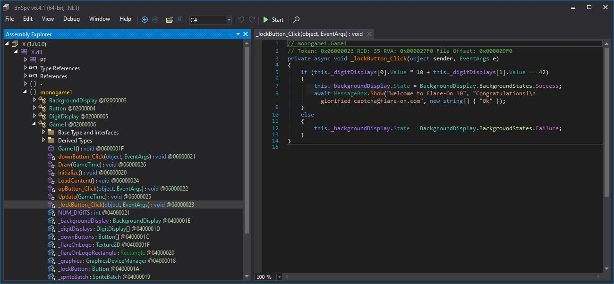

# X

## Overview 

The challenge is a game made with MonoGame. There is a `X.exe`, and when you run it, a window shows up:

You will use the up and down buttons to change the digits and use the lock button to check if it is correct.

## Solution

The simplest way is bruteforce but I won't do that. You can decompile the program by loading `X.dll` into DnSpy.
After digging around, you will find a function called `_lockButton_Click` which handles action when the lock button is clicked.

The fuction simply checks if the number we changed equals to 45.

